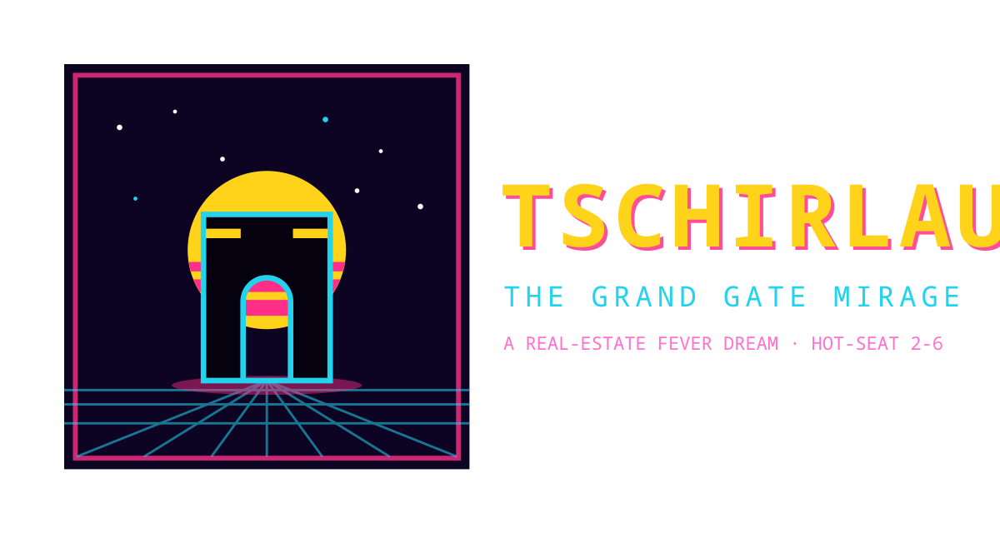

# Tschirlau: The Grand Gate Mirage

A satirical 2D digital board game about a speculative real-estate bubble in the
fictional Oder-Neisse city of Tschirlau. Buy plots, raise gates and towers,
pump the hype, take on debt — then try to survive the crash you all helped
inflate. The bank always wins. Maybe you lose slightly less than everyone else.

Hot-seat multiplayer for **2–6 players**, last solvent tycoon wins, 20 rounds max.

## Features

- Complete rules engine: 40-space board, 20 plots in 4 zones, hidden plot
  quality, construction levels 0–4, rent, mortgages, bank loans, upkeep,
  interest, hype upkeep, bubble meter with early-crash and second-death
  endings, bankruptcy and net-worth victory.
- Full phase arc: BOOM into COOLING at round 11 into a randomized
  HARD/MEDIUM/SOFT CRASH at round 16.
- Synthwave arcade presentation: animated title screen, neon board, game-feel
  juice (dice rattle, particles, banners, screen shake), CRT scanlines.
- Original procedural soundtrack: two 8-bit loops plus a full SFX set,
  synthesized live with the Web Audio API. No audio files needed.
- Offline-first: self-hosted font, zero network calls, static `dist/` build,
  single-executable packaging.

## Quick start

Prerequisite: [Bun](https://bun.com) 1.3+.

```bash
git clone https://github.com/richie-rich90454/tschirlau-game.git
cd tschirlau-game
bun install
bun dev
```

Then open http://localhost:3000/ and pick a player count.

## Scripts

| Command            | What it does                                              |
|--------------------|-----------------------------------------------------------|
| `bun dev`          | Hot-reload dev server (`index.html`)                      |
| `bun run build`    | Offline production bundle into `dist/`                    |
| `bun run serve`    | Serve `dist/` locally on :8080, no downloads needed       |
| `bun run package`  | Build, then compile a single-file `tschirlau` executable  |
| `bun run typecheck`| Strict TypeScript check (`tsc --noEmit`)                  |

The packaged executable embeds the page, the bundle and the fonts, so one
file is the whole game: run it and open http://localhost:8080/.

## Controls

Click any board tile to inspect it (full details appear in the inspector
line, and owned plots load into the build selector). Bottom panel groups:

- **ALWAYS**: ROLL DICE, PAY AMOUNT DUE, END TURN, DECLARE BANKRUPTCY,
  plus BUILD / BANK / DEALS tab toggles.
- **BUILD**: plot selector, defer-payment checkbox, BUILD LEVEL, MORTGAGE,
  LIFT MORTGAGE, ABANDON GATE.
- **BANK**: TAKE LOAN (1–20), REPAY DEBT, SELL CONCRETE / STEEL / GLASS.
- **DEALS**: PLACE BID / PASS BID, partner selector, START JOINT VENTURE,
  COOPERATE / DEFECT / DECLINE VENTURE.

Keyboard: `R` roll, `E` end turn, `B` build selected, `M` music on/off.
Top bar: `BGM`, `RULES` (full in-game manual), `PLAYERS` and `CONTROLS`
panel toggles.

## How to play (short version)

1. **ROLL** 2d6 and move. Passing START pays the stipend (5 / 2 / 0).
2. **RESOLVE** the space: buy free plots, pay rent on finished towers (or
   gain hype at half-built hulks), draw cards, survive upkeep, pitch to
   investors, trigger auctions, rumors, bank visits and joint ventures.
3. **ACT**: build levels 1–4, mortgage, trade with the bank, bid, scheme.
4. **END TURN**: pay upkeep + interest + hype upkeep, or mortgage, sell,
   or go bankrupt.

Watch the bubble meter: building early inflates it, finishing towers and
repaying debt calm it. At 20 it bursts. After the crash, the richest ruin
at round 20 wins.

## Project structure

```
index.html            Browser entry (self-contained: inline fonts + favicon)
src/main.ts           Phaser game config and scene list
src/scenes/           BootScene, PreloadScene, GameScene, UIScene
src/objects/          Player, Plot, Space, Board geometry
src/state/            GameState types, constants and phase logic
src/data/             Board, card and crash data
src/utils/            Formatting helpers, BGMPlayer synth engine
assets/               logo.svg, icon.svg, icon.ico, vendored fonts
build.ts / serve.ts   Offline build and static server scripts
package.ts            Single-executable embedded server entry
```

`src/data/bgmData.ts` is a local-only sketchbook file: it is gitignored,
untracked, and absent from history. The tracked game carries its own
original soundtrack inside the synth engine.

## Tech

Phaser 4, strict TypeScript, Bun (runtime, bundler, package manager),
Web Audio synthesis, Noto Sans Mono (self-hosted, OFL licensed).